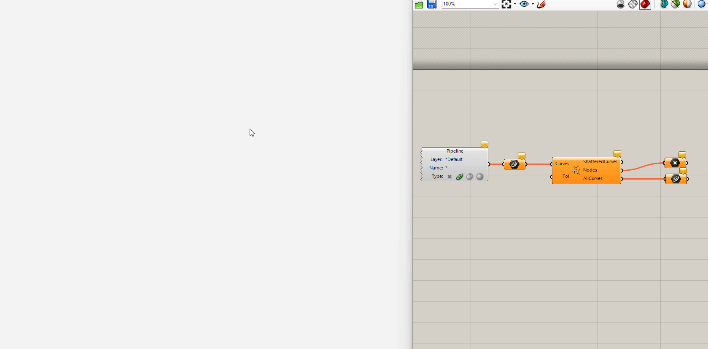
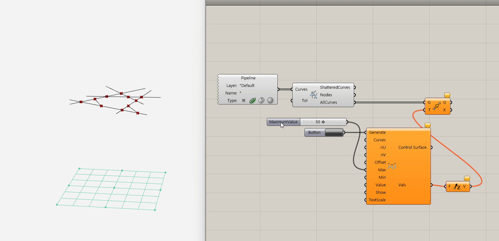
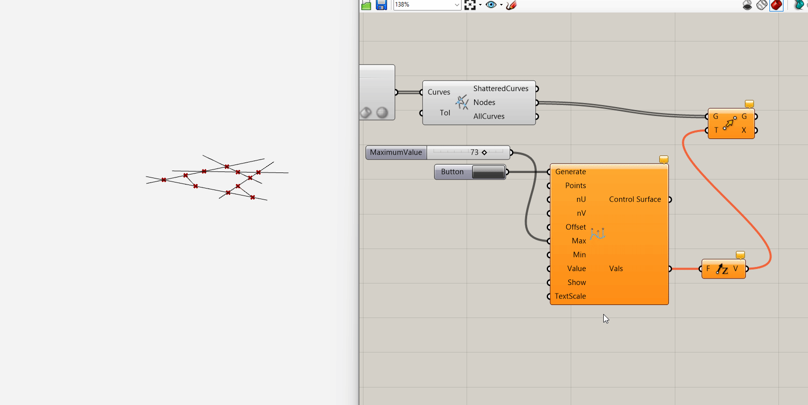
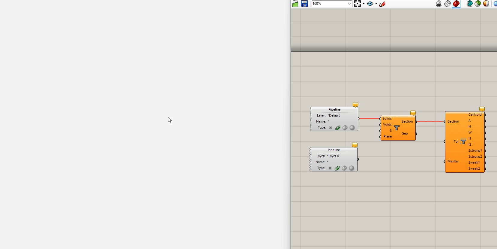
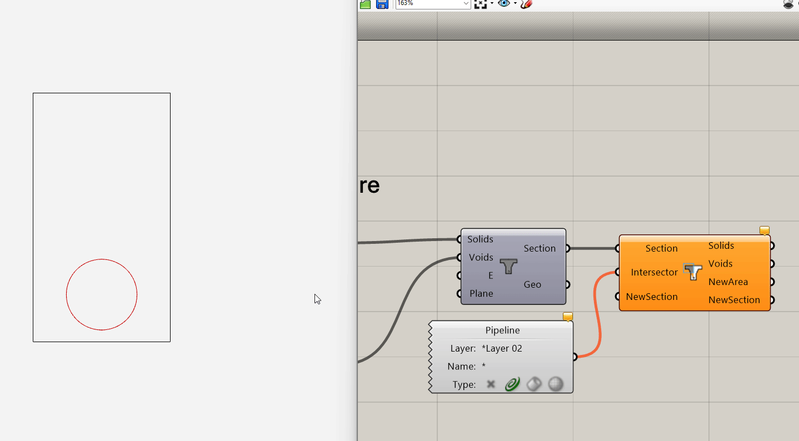
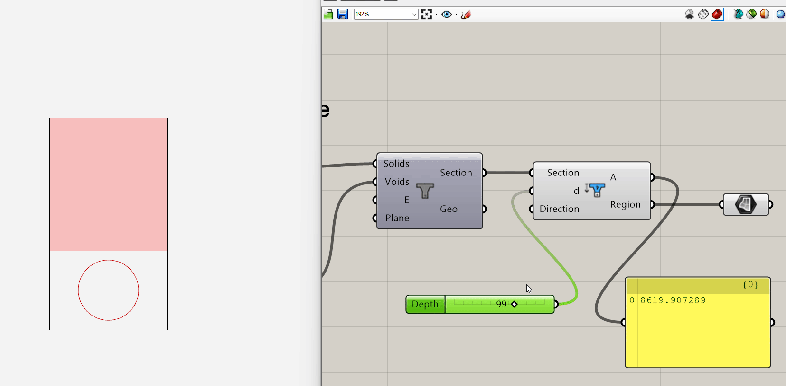
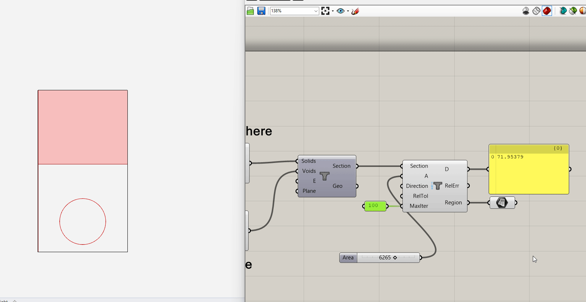

# DSUtilities
Useful workflows that we seem to reinvent every couple of weeks packaged together in compact components. Split into subcategories:

## Topology
### AutoShatter
Automatically detect intersections of curves, shatter at the intersection points, and return all the new shatter curves **without any duplicates**.

### Topologize
Export the topology of a series of interconnected curves. Goes well with AutoShatter. It takes in a list of curves as the input and automatically detects shared end points. Topologize converts the network into a JSON string with the following keys:

- `X` A list of length *n* that stores the X positions of all unique end points
- `Y` The Y position of end points
- `Z` The Z position of end points
- `Istarts` A list of length *m* of the starting node indices of all curves
- `Iends` A list of ending node indices
- `Inodes` An optional parameter that stores the indices of end points that are of interest
  - EG. If drawing a network to export for structural analysis, it may be useful to quickly mark the points that act as supports. Place a point at these positions and input into the component to extract their index in the XYZ fields.

## Parameterization
### ControlSurfaceCurve
Generate a control surface of $u\times v$ points, automatically generate sliders for the Z-height, and map the distance between curve midpoints and the surface as curve-wise values.

### ControlSurfacePoint
Same thing but for points

## Section
Tools for defining arbitrarily complex cross sections and extracting useful information them. Drawn sections must be parallel to the global XYZ planes, and assumes the following:
- Given the selection of (XY, YZ, XZ) planes, where XY is default, the second axis is assumed to be the "Vertical" axis, IE, the first axis represents the "strong" rotational axis.
- All drawn curves that define the section are closed and co-planar

### Section
Define a section using a set of closed curves for solid regions and a set of closed curves for void regions. You can input a list of closed curves for each. **Void regions must be entirely contained within solid regions**

### SectionProperties
Get all the information you could want from a section.

### Intersect
Generate a new section from the intersection of one section with a closed curve (note that this *does* properly exclude voided regions, but is not visualized).

### AfromD
Get the area enclosed at a depth *d* from the top/bottom of the section. By default, *d* representes the distance from the top of the section bounding box; switch `direction` from  -1 to 1 to reverse.

### DfromA
Inverse of above. Given a target area, determine which depth from the top/bottom provides this area. User can select tolerance/number of iterations for solution.

